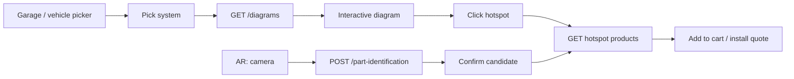

# Next.js Frontend Prompt — Visual Part Finder (2D + AR)

Use this document to implement the **Visual Part Finder** in the Auto-Store web frontend. It extends the base contract in [nextjs-frontend-prompt.md](./nextjs-frontend-prompt.md) (auth envelope, Tailwind minimalist design, API client). Backend reference: [part-finder.md](./part-finder.md), [sample-payloads.md](./sample-payloads.md#visual-part-finder).

**Sample data:** After API startup, a demo diagram exists for **2015–2020 Toyota Camry · Front Brakes** (see seeded hotspots). Filter with `make=Toyota&model=Camry&year=2018&system=brakes`.

---

## 1. What to build

**Visual Part Finder** helps shoppers locate the exact component on an exploded brake/suspension/engine diagram, then jump to matching catalog SKUs. **AR identification** (mobile or webcam) uploads a photo and returns ranked part guesses.

| Persona | Capability |
|---------|------------|
| **Guest** | Pick vehicle + system, browse diagrams, click hotspots, view products |
| **Logged-in customer** | Same + `POST /part-identification` (camera upload) |
| **Admin / vendor** | Create diagrams, draw hotspots, link products (admin UI optional v1) |

**Distinct from:**
- **Product search** (`GET /products/search`) — text/filters; part finder is visual-first
- **Community Q&A** — knowledge threads, not diagrams
- **Installation marketplace** — labor booking after parts are chosen

**Entry points:** Header nav **“Part finder”**, product category **Brakes**, empty search state (“Not sure? Use the visual finder”), product detail **“Find on diagram”** when a diagram exists for that vehicle.

---

## 2. User journey



1. User selects **year, make, model** (reuse garage state from search/Q&A if available).
2. User picks **system** (`brakes`, `suspension`, …) from `GET /vehicle-systems`.
3. App loads matching diagram(s); user pans/zooms and taps a hotspot.
4. Side drawer lists products from `GET /diagrams/:id/hotspots/:hotspotId/products`.
5. Optional AR: capture image → identification API → user confirms top candidate → same product drawer.

---

## 3. API contract

Base URL: `NEXT_PUBLIC_API_URL/api/v1`. Standard envelope: `success`, `data`, `error`, `errors`, `meta`.

### Endpoints

| Method | Path | Auth | Notes |
|--------|------|------|--------|
| GET | `/vehicle-systems` | No | System tabs/chips |
| GET | `/diagrams` | No | Query: `make`, `model`, `year`, `system`, `page`, `limit` |
| GET | `/diagrams/:id` | No | `?include_hotspots=true` embeds regions |
| GET | `/diagrams/:id/hotspots` | No | Hotspot list only |
| GET | `/diagrams/:id/hotspots/:hotspotId/products` | No | `?year=` optional |
| POST | `/part-identification` | Yes | Multipart; see below |
| POST | `/diagrams` | Admin/Vendor | Create diagram |
| PUT | `/diagrams/:id` | Admin/Vendor | Update |
| POST | `/diagrams/:id/hotspots` | Admin/Vendor | Add hotspot |
| PUT | `/diagrams/:id/hotspots/:hotspotId` | Admin/Vendor | Update hotspot |
| POST | `/diagrams/:id/hotspots/:hotspotId/products` | Admin/Vendor | Link SKU |
| DELETE | `/diagrams/:id/hotspots/:hotspotId/products/:productId` | Admin/Vendor | Unlink |
| DELETE | `/diagrams/:id` | Admin | Delete diagram |
| DELETE | `/diagrams/:id/hotspots/:hotspotId` | Admin | Delete hotspot |

Upload diagram images via existing `POST /upload/images` (Admin/Vendor), then pass returned URL in diagram create body.

### List diagrams (`GET /diagrams`)

| Param | Type | Description |
|-------|------|-------------|
| `make` | string | Required for useful results |
| `model` | string | Required |
| `year` | number | Filters `year_start` ≤ year ≤ `year_end` |
| `system` | string | Vehicle system **code** (e.g. `brakes`) |
| `page`, `limit` | number | Pagination |

If multiple diagrams match, prefer the narrowest year range or show a picker.

### Hotspot coordinates

`x`, `y`, `width`, `height` are **percentages (0–100)** of the diagram image, not pixels. Render overlays with:

```typescript
const left = (hotspot.x / 100) * containerWidth;
const top = (hotspot.y / 100) * containerHeight;
```

### Part identification (`POST /part-identification`)

**Content-Type:** `multipart/form-data`

| Field | Required | Description |
|-------|----------|-------------|
| `image` or `file` | Yes | Photo (JPEG/PNG/WebP) |
| `make` | Yes | Vehicle make |
| `model` | Yes | Vehicle model |
| `year` | Yes | Model year |
| `system` | No | System code hint |
| `labels` | No | JSON array string or comma-separated CV labels |

Requires S3 (`S3_BUCKET`). Returns `candidates[]` with `part_name`, `confidence`, `hotspot_id`, `diagram_id`, `product_ids`.

**MVP UX:** Show top 3 candidates; user taps to confirm (human-in-the-loop). Do not auto-add to cart from low-confidence matches.

---

## 4. TypeScript types

```typescript
interface VehicleSystem {
  id: string;
  code: string;
  name: string;
  description?: string;
  display_order: number;
}

interface DiagramListItem {
  id: string;
  title: string;
  make: string;
  model: string;
  year_start: number;
  year_end: number;
  image_url: string;
  vehicle_system: VehicleSystem;
}

interface DiagramHotspot {
  id: string;
  diagram_id: string;
  label: string;
  oem_part_number?: string;
  x: number;
  y: number;
  width: number;
  height: number;
  display_order: number;
}

interface DiagramDetail extends DiagramListItem {
  svg_overlay_url?: string;
  image_width: number;
  image_height: number;
  hotspots?: DiagramHotspot[];
}

interface ProductSummary {
  id: string;
  sku: string;
  name: string;
  brand: string;
  manufacturer_part_number: string;
  price: number;
  condition: string;
  stock_quantity: number;
  primary_image_url?: string;
}

interface PartIdentificationCandidate {
  part_name: string;
  confidence: number;
  hotspot_id?: string;
  diagram_id?: string;
  product_ids: string[];
}

interface PartIdentificationResult {
  id: string;
  image_url: string;
  diagram_id?: string;
  candidates: PartIdentificationCandidate[];
}

interface GarageVehicle {
  make: string;
  model: string;
  year: number;
}
```

Persist garage selection in `localStorage` (or user profile later) as `garage_vehicle` so search, Q&A, and part finder share context.

---

## 5. Pages and UI

Follow minimalist design in [nextjs-frontend-prompt.md §2](./nextjs-frontend-prompt.md#2-design-direction-minimalist--modern).

### 5.1 Part finder hub — `/parts` or `/find-parts`

**Layout (desktop):** two columns — left: vehicle + system controls; right: diagram canvas.

**Controls:**

1. **Vehicle** — year / make / model (required before load). Reuse garage picker component.
2. **System** — horizontal chips from `GET /vehicle-systems` (icons optional: disc for brakes, spring for suspension).
3. **Load** — auto-fetch on change when vehicle + system set: `GET /diagrams?make=...&model=...&year=...&system=...`.

**Empty states:**

| State | Copy |
|-------|------|
| No vehicle | “Select your vehicle to see diagrams” |
| No diagram | “No diagram for this vehicle yet — try search or browse categories” + link to `/products/search` |
| Multiple diagrams | Small dropdown to pick variant (title shows year range) |

### 5.2 Interactive diagram viewer

Use a client component with pan/zoom (e.g. `react-zoom-pan-pinch` or CSS transform + wheel).

1. Show `image_url` full width inside a bordered card (`max-h-[70vh]`).
2. Overlay absolutely positioned `<button>` elements per hotspot (percent → px on resize; use `ResizeObserver`).
3. **Hover:** highlight region + tooltip with `label`.
4. **Click:** set `selectedHotspotId`, open drawer.

**Accessibility:** Each hotspot is a `<button type="button">` with `aria-label={hotspot.label}`. Keyboard: tab through hotspots.

**Mobile:** Pinch-zoom; drawer becomes bottom sheet.

### 5.3 Hotspot product drawer

When hotspot selected:

```
GET /diagrams/{diagramId}/hotspots/{hotspotId}/products?year={garage.year}
```

- Header: hotspot `label`, optional OEM `#`
- List: product cards (image, name, price, stock)
- Actions: **Add to cart** (`POST /cart/items`), **View product**, **Book installation** if `installation_eligible`
- Empty: “No exact match in stock — try search” with link to `GET /products/search?make=...&q={oem}`

### 5.4 AR / camera flow — `/parts/identify` (optional route)

Protected (login required for upload).

1. Explain permissions; show vehicle summary from garage.
2. Optional system chip pre-select.
3. `<input type="file" accept="image/*" capture="environment">` or `getUserMedia` snapshot.
4. Build `FormData`: image + make + model + year + system + labels (if on-device CV adds them later).
5. `POST /part-identification` with progress indicator.
6. Results list: confidence bar, part name, **“Show on diagram”** (navigate to `/parts?diagramId=&hotspotId=`), **“View products”**.

**Webcam MVP:** File input with `capture` is enough; full AR overlay is Phase 2 (Flutter).

### 5.5 Product page integration

On product detail, if garage vehicle set:

```typescript
const diagrams = await listDiagrams({
  make: garage.make,
  model: garage.model,
  year: garage.year,
  system: inferSystemFromCategories(product.categories), // e.g. brakes slug
  limit: 1,
});
```

If diagram exists: CTA **“See where this fits”** → `/parts?diagramId=...` (pre-select related hotspot if `manufacturer_part_number` matches).

### 5.6 Admin diagram editor (optional v1)

Route: `/admin/diagrams` (Admin/Vendor only).

- List diagrams (unpublished included — may need future admin list endpoint; v1: create via API/Postman).
- Form: vehicle, system, image URL (upload widget), year range.
- Hotspot editor: click on image to place rectangle; drag to resize; save via `POST/PUT` hotspots.
- Link product: search SKU → `POST .../products`.

---

## 6. URL state (shareable links)

Support query params on `/parts`:

| Param | Purpose |
|-------|---------|
| `make`, `model`, `year` | Pre-fill garage |
| `system` | Pre-select system code |
| `diagramId` | Open specific diagram |
| `hotspotId` | Open drawer for hotspot |

Example: `/parts?make=Toyota&model=Camry&year=2018&system=brakes&diagramId=...&hotspotId=...`

---

## 7. API client helpers

```typescript
export function listVehicleSystems() {
  return api.get<VehicleSystem[]>("/vehicle-systems", { auth: false });
}

export function listDiagrams(params: {
  make: string;
  model: string;
  year: number;
  system?: string;
  page?: number;
  limit?: number;
}) {
  const qs = new URLSearchParams({
    make: params.make,
    model: params.model,
    year: String(params.year),
    ...(params.system && { system: params.system }),
    page: String(params.page ?? 1),
    limit: String(params.limit ?? 20),
  });
  return api.get<DiagramListItem[]>(`/diagrams?${qs}`, { auth: false });
}

export function getDiagram(id: string, includeHotspots = true) {
  return api.get<DiagramDetail>(
    `/diagrams/${id}?include_hotspots=${includeHotspots}`,
    { auth: false }
  );
}

export function getHotspotProducts(
  diagramId: string,
  hotspotId: string,
  year?: number
) {
  const qs = year != null ? `?year=${year}` : "";
  return api.get<ProductSummary[]>(
    `/diagrams/${diagramId}/hotspots/${hotspotId}/products${qs}`,
    { auth: false }
  );
}

export async function identifyPart(form: FormData) {
  const base = process.env.NEXT_PUBLIC_API_URL + "/api/v1";
  const token = getAccessToken(); // your auth helper
  const res = await fetch(`${base}/part-identification`, {
    method: "POST",
    headers: token ? { Authorization: `Bearer ${token}` } : {},
    body: form,
  });
  return parseEnvelope<PartIdentificationResult>(res);
}
```

---

## 8. SEO and metadata

Part finder is primarily a **tool** page, not long-tail SEO. Still add:

```typescript
export const metadata = {
  title: "Visual Part Finder | Auto-Store",
  description:
    "Interactive exploded diagrams for brakes, suspension, and more. Click the component you need and shop matching parts.",
};
```

No JSON-LD required for v1. Avoid indexing thin diagram-only pages unless you add unique copy per vehicle.

---

## 9. State and UX details

- **Resize:** Recompute hotspot pixel bounds on window/container resize.
- **Loading:** Skeleton for diagram image; spinner in drawer while products load.
- **Errors:** 503 on part-identification when S3 missing — “Photo upload unavailable”.
- **Confidence:** Show `confidence` as percentage; if &lt; 0.6, label “Low confidence — please confirm”.
- **Cart:** Toast on add; keep drawer open for multi-part jobs.
- **Strict Mode:** Single fetch per diagram id in `useEffect` deps `[diagramId]`.

---

## 10. Demo / local testing

1. Start API (migrations seed Camry brakes diagram).
2. Open `/parts?make=Toyota&model=Camry&year=2018&system=brakes`.
3. Click **Front Brake Pad (Left)** — products appear if catalog has `BP-CAMRY-F` or `manufacturer_part_number` `ST-1234` with Camry compat.
4. Log in, test identification with a brake photo + `labels=["brake pad"]`.

---

## 11. Integration checklist

- [ ] Types: `VehicleSystem`, `Diagram`, `DiagramHotspot`, `ProductSummary`, identification result
- [ ] Garage vehicle persisted and shared with search/Q&A
- [ ] `/parts` hub: vehicle + system + diagram viewer
- [ ] Hotspot overlays (percent → responsive px)
- [ ] Product drawer + add to cart
- [ ] Query-param deep links (`diagramId`, `hotspotId`)
- [ ] Product page CTA when diagram exists
- [ ] `/parts/identify` multipart upload (authenticated)
- [ ] Admin hotspot editor (optional)
- [ ] Nav link “Part finder”

---

## 12. References

| Doc | Purpose |
|-----|---------|
| [nextjs-frontend-prompt.md](./nextjs-frontend-prompt.md) | Base stack, auth, design |
| [part-finder.md](./part-finder.md) | Backend overview |
| [endpoints.md](./endpoints.md) | Route table |
| [sample-payloads.md](./sample-payloads.md#visual-part-finder) | Example JSON |
| [nextjs-community-qa-prompt.md](./nextjs-community-qa-prompt.md) | Garage vehicle pattern |
| [nextjs-installation-marketplace-prompt.md](./nextjs-installation-marketplace-prompt.md) | Install CTA from product drawer |

---

## 13. One-line prompt for an AI or developer

**“Implement Visual Part Finder in our Next.js 14 App Router + Tailwind storefront: `/parts` with vehicle + system picker, pan/zoom diagram with percent-based hotspot overlays, product drawer from `GET /diagrams/:id/hotspots/:hotspotId/products`, garage state shared with search, optional `/parts/identify` for authenticated `POST /part-identification`, and product-page CTA when a diagram exists. Use types and API helpers in docs/nextjs-part-finder-prompt.md; demo with Toyota Camry 2018 brakes seed data.”**
